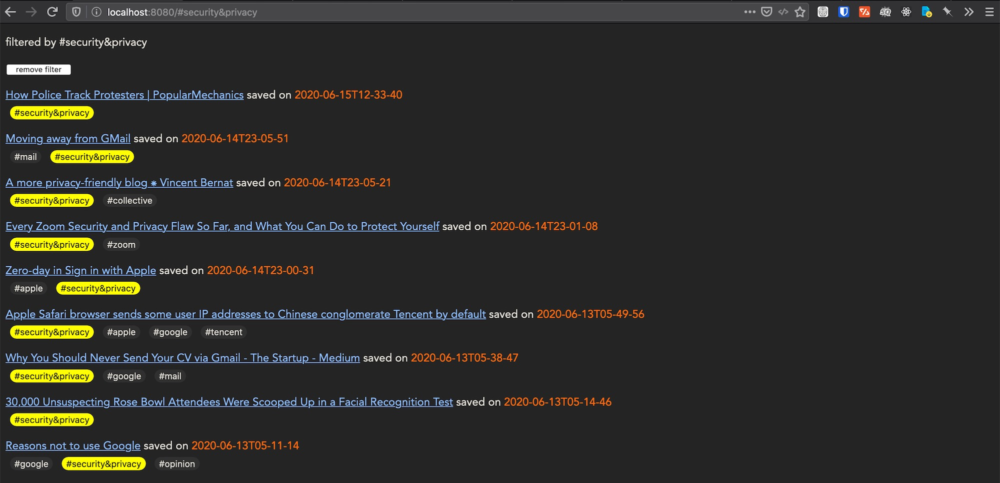

# Deno Hacking: Stupid Simple Pinboard.in Imitation



## Table of Contents

  * [Rationale](#rationale)
      * [tldr](#tldr)
  * [Dependencies](#dependencies)
  * [Installing](#installing)
  * [Insight](#insight)

## Rationale

I use Memex 2 for highlighting and annotating the web. I sometimes found out that some site that I have annotated changed the layout, or the content, thus rendering my past annotation invalid. 

While waiting for Memex 2's local archiving feature, I look around the internet and find that pinboard.in is interesting. It also supports archiving. I consider the pricing too high for my pocket now, I also not sure whether it delivers what I want or no. So I made myself web archiving.

### tldr

I want a web archiver. Pinboard looks good but Im not convinced. So I made my own.


## Dependencies

- SingleFile browser extension [gildas-lormeau/SingleFile](https://github.com/gildas-lormeau/SingleFile)
- Deno [Deno.Land](https://deno.land/)
- http-server [npmjs](https://www.npmjs.com/package/http-server)

I use this file naming for **SingleFile**:

```sh
archive/bookmarks/{url-href}-saved---on-{date-iso}T{hours-locale}-{minutes-locale}-{seconds-locale}-saved---on-{page-title}.html
```


## Installing

1. Install required dependencies.
2. Navigate to any interesting post you'd like to keep the copy of
3. Save the local `html` version with **SingleFile**.
4. Navigate to the saving location. In my case: `cd ~/Downloads/archive`
5. Here is the **Deno** part. Run `deno run --unstable --allow-read --allow-write index.ts`!
6. Then run `http-server`. Open `localhost:8080` in your web browser.

Some of you may want to serve this on your `archive@` subdomain.

I'd be worried about copyright.
Also there's a chance that any site's special JavaScript will interve your main domain.


## Insight

I should've just subscribe to pinboard's archival account instead..
