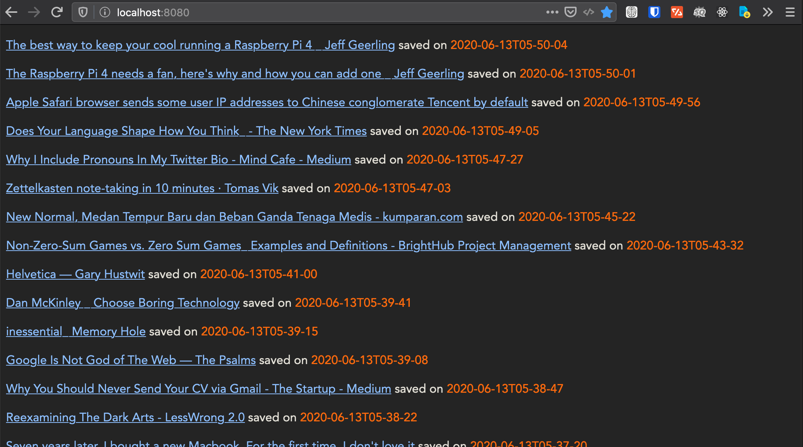

# Deno Hacking: Stupid Simple Pinboard.in Imitation



## Dependencies

- SingleFile browser extension [gildas-lormeau/SingleFile](https://github.com/gildas-lormeau/SingleFile)
- Deno [Deno.Land](https://deno.land/)
- http-server [npmjs](https://www.npmjs.com/package/http-server)

I use this file naming for **SingleFile**:

```sh
archive/bookmarks/{url-href}-saved---on-{date-iso}T{hours-locale}-{minutes-locale}-{seconds-locale}-saved---on-{page-title}.html
```

## Insight

I should've just subscribe to pinboard's archival account instead..
